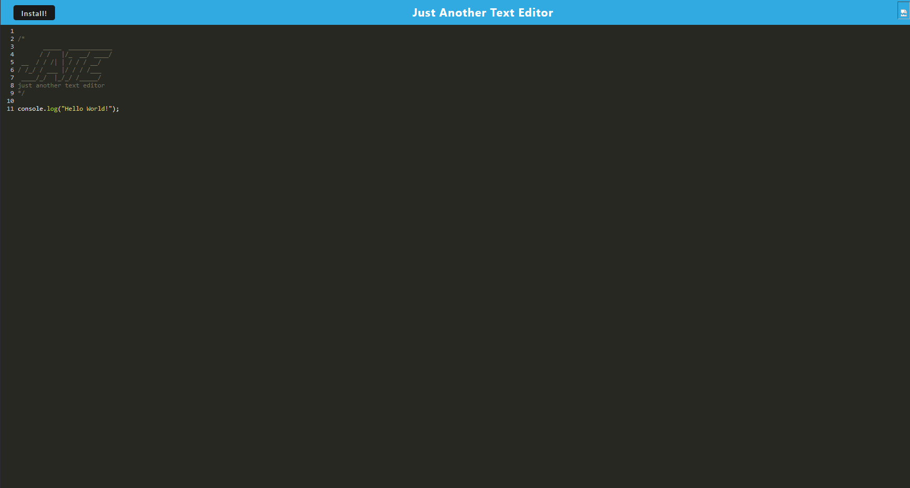

# Just Another Text Editor

As the title suggests, Just Another Text Editor is an in-browser, JavaScript based text editor. You can use it to help preview your code projects as well as download the source code of your own session into your browser's storage.

**Link**: [Here](https://github.com/Shrcker/text-editor)

**Deployment Link**: [Here](https://text-editor-kqgg.onrender.com/)

## Installation

Visit the link above to the deployed application and simply click the "Install" button on the top left of the application; the Install button will download the project through your browser! Note that, currently, this feature is not supported in Firefox.

## Usage

Use the application to preview your code before writing it into a more rigorous text editor that may be able to run it.

## Credits

The original code base is taken from the OSU Coding Boot Camp program and modified to be functional by me, Shrcker! All credits for the majority of the application's base functionality goes to whoever wrote the original code.
